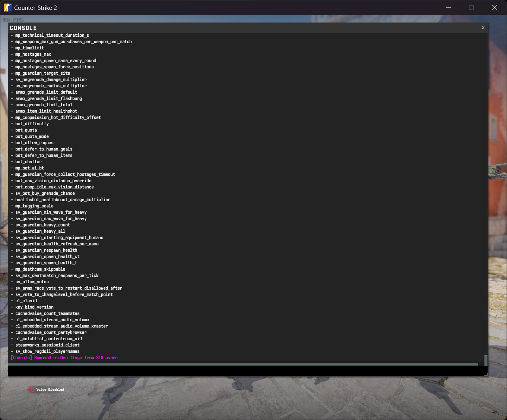

# cvar-unhide-s2



A Source 2 plugin to reveal all console variables and commands that are marked as hidden or development-only in Counter-Strike 2.

> Important: You must add `-insecure` to Counter-Strike's launch options for this plugin to load.

## Supported games

- Counter-Strike 2

## Installation

1. **Download the latest release of the plugin**: \
   https://github.com/saul/cvar-unhide-s2/releases/latest
1. **Extract the contents of the ZIP to the game's mod folder.**

   - 📂 `$STEAM\steamapps\common\Counter-Strike Global Offensive\game\csgo`

   After extraction there should be an `addons` folder in the game folder, e.g. `Counter-Strike Global Offensive\game\csgo\addons\...`

1. **Update the `game\csgo\gameinfo.gi` file**: \
   Around line 22, add the `Game csgo/addons` search path. This tells the engine to load the plugin before loading Counter-Strike.

   ```diff
   FileSystem
   {
   	SearchPaths
   	{
   		Game_LowViolence	csgo_lv // Perfect World content override

   +		Game	csgo/addons
   		Game	csgo
   		Game	csgo_imported
   		Game	csgo_core
   		Game	core
   ```

1. **Start the game from Steam.** \
   ⚠ Counter-Strike must be launched with `-insecure` in the launch options. If you don't know how to do this, take a look this [Steam Community guide](https://steamcommunity.com/sharedfiles/filedetails/?id=379782151).

If you want to disable cvar-unhide-s2:

- Remove the `Game	csgo/addons` line from the gameinfo.gi file.
- Remove `-insecure` from the game's launch options.

## Available commands

If you installed the plugin correctly, you should now be able to use the following commands in the console:

- **cvar_unhide**: Reveal all hidden/development-only convars/concommands.
